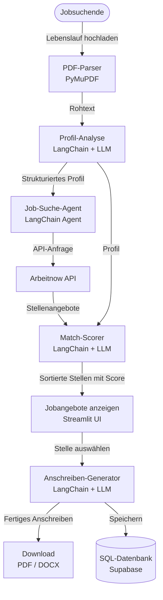

## Python Kurs 3 ECTS

## https://agent-jobs-python.streamlit.app/

## APIs
Arbeitsagentur Jobsuche API: https://jobsuche.api.bund.dev/
Arbeitnow API: https://www.arbeitnow.com/api/job-board-api

# Dokumentation Sahan

Der PyJobAgent soll das Bewerbungsverfahren für Jobsuchende schneller und einfacher machen. Aktuell im Mai 2026 ist die Jobsituation in Deutschland für junge Absolventen nicht besonders einfach. Man muss im Durchschnitt viel mehr Bewerbungen als vor 5 Jahren senden, um faire Jobangebote zu bekommen.

Man kennt das klassische Bewerbungsverfahren bereits:
Jobportale durchsuchen → Passende Stellen finden → Anschreiben für die Stelle schreiben → Anschreiben + Lebenslauf versenden → Vorstellungsgespräch → Zusage/Absage

Insbesondere ist das Erstellen eines passenden Anschreibens eine zeitaufwendige und repetitive Aufgabe, die man für jedes Jobangebot neu erledigen muss.

Aus diesem Grund soll unser Agent diesen Prozess des Anschreibens agiler machen.

# C4 Diagramm Nicolas 
Drawio

# Workflow Sahan
## Lebenslauf hochladen
Der User lädt seinen Lebenslauf hoch. Das LLM liest und versteht allgemein das Profil aus dem Lebenslauf.

## Anschreiben Beispiele vom User hochladen als Referenz hochladen

## Agent sucht Jobempfehlungen nach Profil
Der LangChain-Agent nutzt eine APIs (Arbeitnow) und sucht passende Stellenangebote.

## Agent bewertet die gefundenen Stellen
Der Agent vergleicht das Profil mit jeder Stelle und vergibt einen Match-Score (0-100) mit kurzer Begründung. Die Stellen werden nach Score sortiert angezeigt.

## Agent zeigt dem User passende Jobangebote
Der User wählt die passende Stelle aus und dann erstellt der Agent das Anschreiben für die Bewerbung anhand der Stellenausschreibung automatisch.

## User lädt Anschreiben herunter als PDF/DOCX

## SQL-Historie für bereits erstellte Anschreiben
Der Agent speichert in einer SQL-Datenbank die Stellen, für die er bereits ein Anschreiben geschrieben hat.


## Datenbank Nicolas
Für die Speicherung der Userdaten und der Bewerbungs-Historie nutzen wir Supabase, wegen der einfachen Auth.


# Technische Sachen Nicolas
Librarires
Architektur
Datenbank Historie

# Hosting in der Streamlit Community Cloud.
Alternativen:
- Vercel
- Render



---

# Implementierung (Nicolas)

Dieser Abschnitt beschreibt, wie der obige Workflow technisch umgesetzt wurde — welche Bibliotheken, welche Architektur und wie die einzelnen Module zusammenhängen.

## Setup

### Voraussetzungen
- Python 3.12+
- API-Keys für Groq, Google Gemini und Supabase

### Installation
```bash
pip install -r requirements.txt
```

### Secrets lokal einrichten (`.streamlit/secrets.toml`)

Statt einer `.env`-Datei nutzt die App Streamlit Secrets — sowohl lokal als auch in der Cloud wird dieselbe Datei genutzt. Lokal die Datei `.streamlit/secrets.toml` anlegen (ist gitignored):

```toml
GROQ_API_KEY = "dein_groq_key"
GOOGLE_API_KEY = "dein_google_key"
SUPABASE_URL = "https://dein-projekt.supabase.co"
SUPABASE_KEY = "sb_publishable_..."
```

### App starten
```bash
streamlit run Frontend_UI/app.py
```

---

## Projektstruktur

```
agent-jobs-python/
│
├── Agent_Langgraph/              # Business-Logic-Paket (kein Streamlit)
│   ├── __init__.py               # Exportiert build_graph und JobAgentState
│   ├── graph.py                  # LangGraph Pipeline zusammenbauen
│   ├── nodes.py                  # Die 3 Verarbeitungs-Nodes
│   ├── state.py                  # Gemeinsamer Zustand der Pipeline
│   ├── models.py                 # Pydantic-Datenmodelle
│   ├── download_pdf.py           # PDF-Erzeugung mit fpdf2
│   └── db.py                     # Supabase-Client: Auth + Profil lesen/schreiben
│
├── Frontend_UI/                  # Streamlit UI
│   ├── app.py                    # Einstiegspunkt: Secrets-Bridge + Auth-Sidebar + Navigation
│   ├── input_section.py          # UI: Eingabebereich + Profil-Toggle
│   ├── progress_section.py       # UI: Pipeline ausführen + Fortschrittsanzeige
│   ├── results_section.py        # UI: Ergebnisse anzeigen + PDF-Download
│   └── pages/
│       ├── agent_page.py               # Seite 1: Vollautomatischer Modus
│       └── anschreiben_generator_page.py # Seite 2: Manueller Modus
│
├── .streamlit/
│   └── secrets.toml              # Lokale Secrets (gitignored!)
│
├── job_search.py                 # Arbeitnow API + Keyword-Filter
├── lebenslauf_analayse.py        # CV-Analyse mit Groq LLM
├── matching_score.py             # Job-Scoring mit Groq LLM
├── generate_anschreiben.py       # Anschreiben-Generierung mit Gemini
└── read_anschreiben_orientierung.py  # Stil-Referenz aus PDF lesen
```

---

## Architektur: LangGraph Pipeline

Der Kern der Anwendung ist eine **sequenzielle LangGraph-Pipeline** mit drei Nodes. LangGraph ist ein Framework um KI-Agenten als gerichtete Graphen zu bauen — jeder Node ist ein Verarbeitungsschritt, der den gemeinsamen Zustand (`JobAgentState`) liest und aktualisiert.

```
START → cv_analyse_node → job_search_node → anschreiben_node → END
```

### Gemeinsamer Zustand (`state.py`)

Alle Nodes teilen sich ein `TypedDict` namens `JobAgentState`. Es funktioniert wie ein Staffelstab: jeder Node liest was er braucht und schreibt seine Ergebnisse rein.

```python
class JobAgentState(TypedDict):
    cv_path: str               # Pfad zur hochgeladenen PDF
    user_input: str            # Stellenwunsch des Users ("Werkstudent IT...")
    anschreiben_path: str | None  # optionale Stil-Referenz PDF
    cv_text: str               # extrahierter Rohtext aus dem Lebenslauf
    candidate_profile: CandidateProfile | None  # strukturiertes Profil
    ranked_jobs: list[dict]    # alle bewerteten Stellen
    best_job: pd.DataFrame | None  # die beste Stelle
    anschreiben: AnschreibenSchema | None  # fertiges Anschreiben
```

### Node 1: CV-Analyse (`cv_analyse_node`)

**Was passiert:** Der Lebenslauf (PDF) wird mit PyMuPDF als Rohtext extrahiert. Danach analysiert ein **Groq LLM (Llama 3.3-70B)** den Text und gibt ein strukturiertes `CandidateProfile` zurück.

**`CandidateProfile` enthält:**
- Name, Kontakt
- Skills und Erfahrungen
- Bildungsabschlüsse
- Sprachen
- Job-Typ (z.B. `"intern"`, `"fulltime"`)
- `search_keywords` — Stichwörter für die Jobsuche (z.B. `["Python", "Cloud", "AWS"]`)

Das Profil ist ein **Pydantic-Modell**, d.h. das LLM muss eine valide JSON-Struktur zurückgeben — keine freie Textantwort.

**BEISPIEL für strukturiertes JSON**:
``` json
{
  "name": "Max Mustermann",
  "skills": ["SQL", "Java", "R Programming", "Microsoft Office", "BPMN"],
  "experience_years": 1,
  "education": "Business Information Systems (B. Sc.)",
  "languages": ["German", "English"],
  "search_keywords": [
    "Werkstudent",
    "IT",
    "Informatik",
    "Java",
    "Developer"
  ]
}
```

### Node 2: Jobsuche & Scoring (`job_search_node`)

**Was passiert:** Zwei Schritte in einem Node:

**2a — Jobsuche** (`job_search.py`):
- Ruft die **Arbeitnow API** auf (kostenlose Job-Board API)
- Filtert nach `job_type` aus dem Kandidatenprofil (z.B. nur Werkstudenten-Stellen)
- Filtert nach Keyword-Übereinstimmungen in Stellentitel und Beschreibung
- Gibt die Top-5 Treffer als Pandas DataFrame zurück

**2b — Matching Score** (`matching_score.py`):
- Schickt alle 5 Stellen + den Lebenslauf-Text an **Groq LLM**
- Das LLM vergibt für jede Stelle einen Score von 0–100 und eine kurze Begründung (`begrundung`)
- Rückgabe als JSON-Array, das direkt in einen DataFrame umgewandelt wird
- Die Stelle mit dem höchsten Score wird als `best_job` gespeichert


### Node 3: Anschreiben-Generierung (`anschreiben_node`)

**Was passiert:** Die beste Stelle + der Lebenslauf-Text werden an **Google Gemini 2.5 Flash** übergeben. Gemini gibt das Anschreiben als strukturiertes JSON zurück, das dem `AnschreibenSchema` Pydantic-Modell entspricht.

**`AnschreibenSchema` enthält:**
```python
class AnschreibenSchema(BaseModel):
    absender: Absender      # Name, Straße, Ort, Telefon, E-Mail
    empfaenger: Empfaenger  # Unternehmen, Ansprechpartner, Adresse
    datum: str
    betreff: str
    anrede: str
    absaetze: list[str]     # Fließtext als Liste von Absätzen
    abschluss: str
    unterschrift: str
```

Der Vorteil der strukturierten Ausgabe: Die UI kann jeden Abschnitt separat als editierbares Textfeld anzeigen — der User kann das Anschreiben direkt im Browser anpassen.

---

## LLM-Einsatz im Überblick

| Schritt | Modell | Warum |
|---------|--------|-------|
| CV-Analyse | Groq Llama 3.3-70B | Schnell, kostenlos, gut für strukturierte JSON-Extraktion |
| Job-Scoring | Groq Llama 3.3-70B | Muss 5 Stellen gleichzeitig bewerten → großes Kontextfenster nötig |
| Anschreiben | Google Gemini 2.5 Flash | Bessere Schreibqualität für langen, fließenden deutschen Text |

---

## Benutzeroberfläche (Streamlit)

Die UI ist als **Multi-Page Streamlit App** gebaut. Streamlit führt das gesamte Skript bei jeder Benutzerinteraktion neu aus — daher wird der Pipeline-Zustand in `st.session_state` gespeichert, damit das Ergebnis nach dem Klick erhalten bleibt.

### Zwei Seiten / Modi

**Seite 1 — Agent Anschreiben (vollautomatisch):**
- User lädt Lebenslauf hoch und beschreibt Stellenwunsch in Freitext
- Agent sucht selbstständig passende Stellen über die API
- Zeigt Ranking aller gefundenen Stellen + generiertes Anschreiben

**Seite 2 — Anschreiben Generator (manuell):**
- User lädt Lebenslauf hoch und fügt eine konkrete Stellenausschreibung per Copy & Paste ein
- Kein API-Aufruf — direkt zum Anschreiben
- Sinnvoll wenn man bereits eine Stelle gefunden hat

### Layout
Beide Seiten nutzen ein 50/50 Zwei-Spalten-Layout (`layout="wide"`):
- **Links:** Eingabefelder
- **Rechts:** Ergebnisse (erscheint nach Pipeline-Lauf)

### PDF-Download (`download_pdf.py`)

Das fertige Anschreiben wird mit **fpdf2** als PDF generiert. Da LLMs gelegentlich typografische Unicode-Zeichen zurückgeben (En-Dash `–`, geschweifte Anführungszeichen `""`), die der Helvetica-Font nicht unterstützt, werden diese vor der PDF-Erzeugung automatisch durch ASCII-Äquivalente ersetzt.

---

## Supabase: Datenbankanbindung & Authentifizierung

### Warum Supabase?

Supabase stellt kostenlos eine Postgres-Datenbank mit eingebautem Auth-System bereit. Für dieses Projekt brauchen wir kein eigenes User-Management zu bauen — Supabase übernimmt E-Mail/Passwort-Login, Token-Verwaltung und Session-Handling.

### Datenbankschema

Es gibt nur eine eigene Tabelle:

```sql
CREATE TABLE user_profiles (
    user_id          uuid PRIMARY KEY REFERENCES auth.users(id) ON DELETE CASCADE,
    cv_text          text,           -- extrahierter Rohtext des Lebenslaufs
    candidate_profile jsonb,         -- CandidateProfile als JSON gespeichert
    updated_at       timestamptz DEFAULT now()
);
```

`auth.users` wird von Supabase automatisch verwaltet — dort landen E-Mail und Passwort-Hash. Unsere `user_profiles`-Tabelle speichert nur den CV-Inhalt und das bereits analysierte Profil.

**Row Level Security (RLS)** ist aktiviert: Jeder User kann ausschließlich seine eigene Zeile lesen und schreiben — kein User sieht Daten anderer.

### Der `db.py` Client

`Agent_Langgraph/db.py` ist der einzige Ort, der mit Supabase spricht. Er bietet fünf Funktionen:

| Funktion | Was sie tut |
|---------|-------------|
| `sign_up(email, password)` | Neuen Account erstellen |
| `sign_in(email, password)` | Einloggen, gibt `user.id` zurück |
| `sign_out()` | Session beenden |
| `get_profile(user_id)` | Gespeichertes CV + Profil laden, `None` wenn noch keins |
| `save_profile(user_id, cv_text, profile)` | Profil anlegen oder überschreiben (upsert) |

### Auth-Flow in der App

```
User öffnet App
    ↓
app.py: Sidebar zeigt "Anmelden / Registrieren" (optional, aufklappbar)
    ↓
User gibt E-Mail + Passwort ein → sign_in() → Supabase verifiziert
    ↓
st.session_state["user_id"] = user.id   ← bleibt für gesamte Browser-Session gesetzt
    ↓
App rerunnt → Sidebar zeigt "Eingeloggt als ..."
```

Streamlit führt das Skript bei jeder Interaktion neu aus. `st.session_state` überlebt diese Reruns innerhalb einer Browser-Session — so bleibt der Login erhalten bis der Tab geschlossen wird.

### Das gespeicherte Profil: CV-Upload nur einmal

Wenn ein eingeloggter User ein Anschreiben generiert, wird sein CV-Text und das analysierte `CandidateProfile` automatisch in der Datenbank gespeichert. Beim nächsten Besuch erscheint ein Toggle:

```
[✓] Gespeichertes CV-Profil verwenden
```

Ist der Toggle aktiv, wird `cv_analyse_node` in der Pipeline **komplett übersprungen** — das Profil kommt direkt aus der DB. Das spart einen LLM-Aufruf und Zeit.

```
Erster Besuch:  START → cv_analyse → job_search → anschreiben → END
                                          ↓ nach Pipeline
                                    Profil in DB speichern

Rückkehr:       START →              job_search → anschreiben → END
                         Profil aus DB geladen ↑
```

### Secrets-Management: Die Bridge

Die Business-Logic-Module (`matching_score.py`, `lebenslauf_analayse.py` etc.) sind normale Python-Module ohne Streamlit-Abhängigkeit — sie lesen API-Keys aus `os.environ`. Streamlit stellt Secrets aber über `st.secrets` bereit.

Die Lösung ist eine **Bridge** am Anfang von `app.py`, die einmalig beim Start läuft:

```python
for _key, _val in st.secrets.items():
    if isinstance(_val, str):
        os.environ.setdefault(_key, _val)
```

Danach lesen alle Module ihre Keys aus `os.environ` — egal ob lokal oder in der Cloud. `st.secrets` direkt in den Modulen zu nutzen wäre schlechtes Design, weil die Module dann von Streamlit abhängig wären und nicht mehr als eigenständige Skripte nutzbar wären.

---

## Hosting auf Streamlit Community Cloud

### Warum Streamlit Community Cloud?

Kostenlos, direkt mit GitHub verbunden, kein Server-Management. Für ein Uni-Projekt die ideale Wahl.

### Deploy-Schritte

1. **Code auf GitHub pushen**
```bash
git add .
git commit -m "feat: vollständige App"
git push
```

2. **App auf [share.streamlit.io](https://share.streamlit.io) erstellen**
   - Repository auswählen
   - **Main file path:** `Frontend_UI/app.py`
   - Branch: `main`

3. **Secrets in der Web-UI eintragen** (Settings → Secrets):
```toml
GROQ_API_KEY = "..."
GOOGLE_API_KEY = "..."
SUPABASE_URL = "https://..."
SUPABASE_KEY = "sb_publishable_..."
```

4. **Deploy** — die App bekommt eine öffentliche URL.

---

## Verwendete Bibliotheken

| Bibliothek | Zweck |
|-----------|-------|
| `langgraph` | Pipeline-Orchestrierung der KI-Nodes |
| `langchain-groq` | Verbindung zu Groq API (Llama 3.3-70B) |
| `google-genai` | Verbindung zu Google Gemini |
| `pymupdf` (fitz) | PDF-Text extrahieren |
| `fpdf2` | PDF-Dokument erzeugen |
| `streamlit` | Web-UI |
| `supabase` | Datenbankanbindung + Auth |
| `pydantic` | Strukturierte LLM-Outputs validieren |
| `pandas` | Stellenangebote als DataFrame verwalten |
| `requests` | Arbeitnow API aufrufen |
