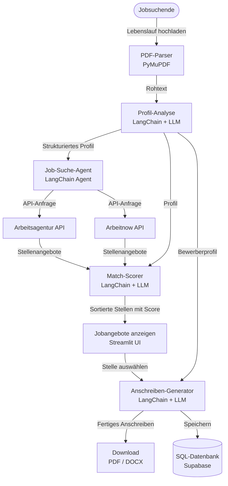

## Python Kurs 3 ECTS

## APIs
Arbeitsagentur Jobsuche API: https://jobsuche.api.bund.dev/
Arbeitnow API: https://www.arbeitnow.com/api/job-board-api

# Dokumentation

Der PyJobAgent soll das Bewerbungsverfahren für Jobsuchende schneller und einfacher machen. Aktuell im Mai 2026 ist die Jobsituation in Deutschland für junge Absolventen nicht besonders einfach. Man muss im Durchschnitt viel mehr Bewerbungen als vor 5 Jahren senden, um faire Jobangebote zu bekommen.

Man kennt das klassische Bewerbungsverfahren bereits:
Jobportale durchsuchen → Passende Stellen finden → Anschreiben für die Stelle schreiben → Anschreiben + Lebenslauf versenden → Vorstellungsgespräch → Zusage/Absage

Insbesondere ist das Erstellen eines passenden Anschreibens eine zeitaufwendige und repetitive Aufgabe, die man für jedes Jobangebot neu erledigen muss.

Aus diesem Grund soll unser Agent diesen Prozess des Anschreibens agiler machen.

# Workflow
## Lebenslauf hochladen
Der User lädt seinen Lebenslauf hoch. Das LLM liest und versteht allgemein das Profil aus dem Lebenslauf.

## Anschreiben Beispiele vom User hochladen als Referenz hochladen

## Agent sucht Jobempfehlungen nach Profil
Der LangChain-Agent nutzt zwei APIs (Arbeitsagentur und Arbeitnow) und sucht passende Stellenangebote.

## Agent bewertet die gefundenen Stellen
Der Agent vergleicht das Profil mit jeder Stelle und vergibt einen Match-Score (0-100) mit kurzer Begründung. Die Stellen werden nach Score sortiert angezeigt.

## Agent zeigt dem User passende Jobangebote
Der User wählt die passende Stelle aus und dann erstellt der Agent das Anschreiben für die Bewerbung anhand der Stellenausschreibung automatisch.

## User lädt Anschreiben herunter als PDF/DOCX

## SQL-Historie für bereits erstellte Anschreiben
Der Agent speichert in einer SQL-Datenbank die Stellen, für die er bereits ein Anschreiben geschrieben hat.

## Datenbank
Für die Speicherung der Userdaten und der Bewerbungs-Historie nutzen wir Supabase, wegen der einfachen Auth.

# Hosting in der Streamlit Community Cloud.
Alternativen:
- Vercel
- Render

